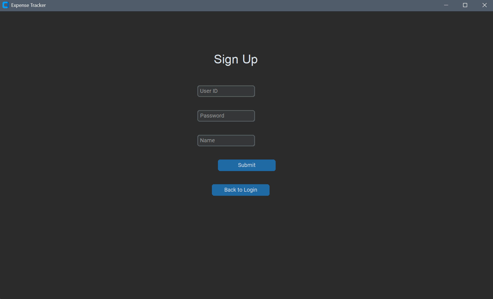

# Expenses-Tracker

A Tkinter-based expense tracking desktop application with PostgreSQL integration. This application allows users to manage their daily expenses, set monthly budgets, and visualize their spending habits.

## Table of Contents

- [Features](#features)
- [Tech Stack](#tech-stack)
- [Prerequisites](#prerequisites)
- [Installation](#installation)
- [Database Setup](#database-setup)
- [Running the Application](#running-the-application)
- [UI Screenshots](#ui-screenshots)
- [Folder Structure](#folder-structure)
- [Future Enhancements](#future-enhancements)

---

## Features

- User registration and login system
- Set and track monthly budgets
- Add expenses with category, date, and comments
- Get alerts when spending exceeds budget
- Visual representation of expenses using pie charts
- Data persistence with PostgreSQL
- Intuitive CustomTkinter-based UI
- Easy exporting to CSV for better understanding

---

## Tech Stack

- **Language:** Python 3.8+
- **GUI Framework:** CustomTkinter
- **Database:** PostgreSQL
- **Data Visualization:** Matplotlib
- **Dependencies:** psycopg2, customtkinter, matplotlib

---

## Prerequisites

Make sure you have the following installed on your system:

- Python 3.8 or above
- PostgreSQL
- pip (Python package installer)

Install required Python packages:
-pip install customtkinter psycopg2 matplotlib

Update your credentials for the SQl Server

---

## Database Setup

- Create the PostgreSQL database
- Connect to the database
- Create required tables

---

## Running The Application

- After setting up the database and updating credentials:

**python expense_tracker.py**

---

## UI Screenshots

| Screen Name       | File Path                     | Description                             |
|-------------------|-------------------------------|-----------------------------------------|
| Login Page        | !(screenshots/login.png)         | User login interface                    |
| Signup Page       | screenshots/signup.png        | New user registration form              |
| Home Dashboard    | screenshots/home.png          | Dashboard showing budget summary        |
| Add Expense Form  | screenshots/add_expense.png   | UI for adding daily expenses            |
| Set Budget Page   | screenshots/set_budget.png    | Monthly budget setup form               |
| Export to CSV     | screenshots/alert.png         | CSV Downloaded to PC                    |
| Expense Chart     | screenshots/chart.png         | Visual representation of expenses       |

### Login Screen

### Login Screen Success

### Home Screen 

### Signup Screen 

### Add Expense Screen 

### Budget Setting Screen 

### CSV Screen 

### Total Expense Screen 

--

## Folder Structure

expense-tracker/ │ ├── expense_tracker.py # Main application file ├── screenshots/ # Folder to hold UI images │ ├── login_screen.png │ ├── dashboard.png │ └── ... # Other UI screenshots ├── side.jpeg # Asset image for sidebar or UI ├── background.png # Background image for the application ├── data.sql # SQL queries to be executed in your PostgreSQL DB └── README.md # Project documentation

---

## Future Enhancements

- Export reports to CSV
- Filter reports by date range
- Add email notifications for alerts
- Track shared/group expenses
- Docker container setup for deployment
- Host database on the cloud

---
